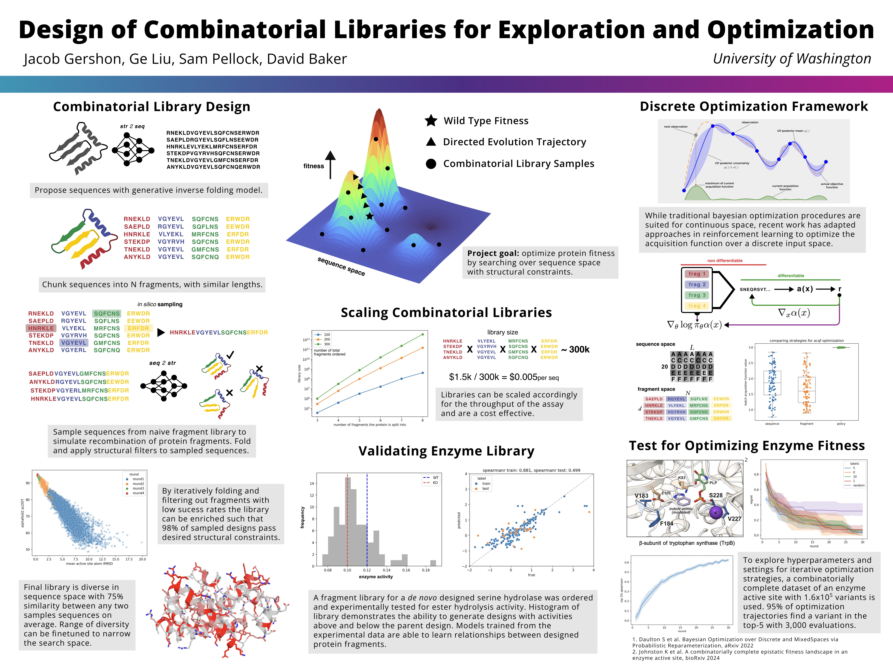

# cleo
#### designing combinatorial libraries for protein optimization

this code base is split into basic elements of iterative optimization:

 change from loop dev

- data storage and maintenance
- surrogate function training (models learning seq/str/emb --> fitness)
- candidate selection (selecting next set of sequences to test)

