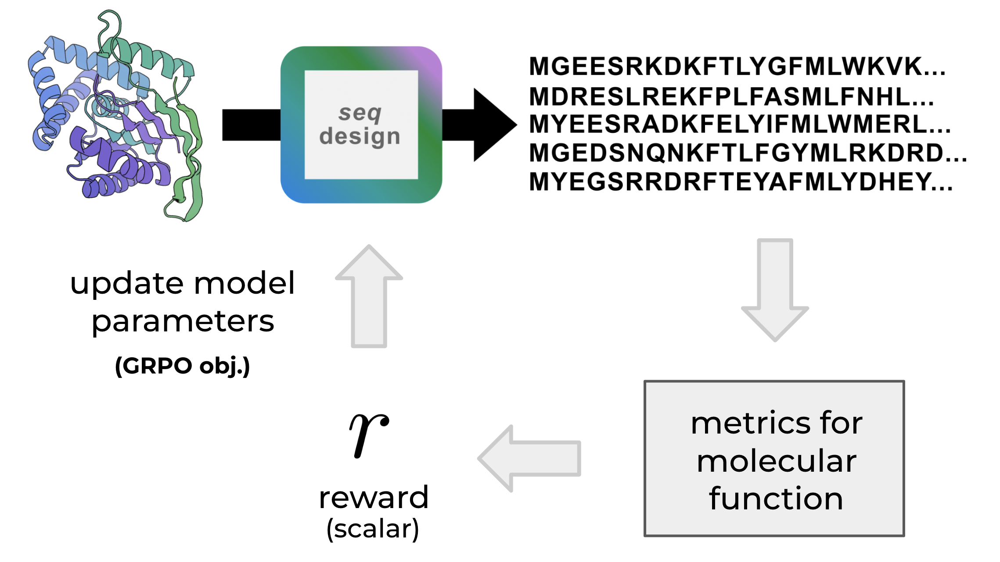

# CLEO 🦠 🚀

**Combinatorial Libraries for Exploration and Optimization (CLEO)** is a framework for designing protein libraries and using experimental data to guide exploration and optimization. It focuses on enhancing an already functional protein construct using experimental feedback. See the [tutorial](#-tutorial) below for a full walkthrough.

## 🛠️ Installation

CLEO uses [uv](https://docs.astral.sh/uv/) for fast, reproducible Python environment management. Requires **Python ≥ 3.10**.

```bash
# 1. Install uv (if you don't have it already)
curl -LsSf https://astral.sh/uv/install.sh | sh

# 2. Clone the repository
git clone <repo-url> && cd cleo

# 3. Create the virtual environment and install all dependencies
uv sync              # CPU-only (includes Boltz for CPU inference)
uv sync --extra cuda # GPU — adds CUDA acceleration for Boltz

# 4. Activate the environment
source .venv/bin/activate
```

After activation, all `cleo-design-*` and `cleo-optimize-*` CLI commands in this tutorial will work. The full pipeline (training, sampling, resampling, evaluation, DNA design) runs on CPU. GPU acceleration is only needed for faster Boltz structure predictions during training or evaluation.

---
<br><br>

## 🌐 Tutorial

The two main themes of this workflow are:

[**Library Design**](#-library-design)
   - [Library constraints](#-library-constraints)
   - [Aligning proteinMPNN to rewards](#-aligning-proteinmpnn-to-rewards)
   - [Sampling and filtering sequence fragments](#-sampling-and-filtering-sequence-fragments)
   - [Reverse Translation and Order Preparation](#-reverse-translation-and-order-preparation)

[**Multi Round Experimental Optimization**](#-multi-round-experimental-optimization)  
   - [Data collection philosophy and assay design](#-data-collection-philosophy-and-assay-design)  
   - [Strategies for early rounds of testing](#-early-rounds-of-testing)  
   - [Training sequence-to-function models](#-training-sequence-to-function-models)  
   - [Proposing batch of sequences to test next](#-proposing-batch-of-sequences-to-test-next)  
   - [Looping it all together](#-looping-it-all-together)

[**Naming Conventions**](#-naming-conventions)

[**Help & Contributing**](#-help--contributing)

[**License**](#-license)

---
<br><br>

# ⚙️ Library Design


Changes in protein sequence space can lead to major jumps in function. To explore the surrounding sequence of a particular protein, this workflow will act as a guide to designing large scale libaries. To generate such libraries we will split a protein into fragments, propose many options for each fragment, and ordering the fragments independently will allow us to stitch the DNA together *in vitro* to create unique variants to test. This tutorial uses PETase (a plastic-degrading enzyme) as an example, however the workflow can apply widely to other proteins. The following steps will serve as a guide for first aligning proteinMPNN to custom reward functions and then sampling sequence fragments to create a library for experimental testing.

📌 **Note**: The libraries designed here focus on a single fold space, each variant will adopt a unique atomic constellation but retain a consistent topology. 

## 📐 Library constraints
One of the first steps to consider is how to split your protein into fragments. We recommend splitting the protein into equal length fragments of **20-50** amino acids for a total of **4-6** fragments. Splitting into equal size fragments helps ensure the *in vitro* assembly process is robust. Aiming for **4-6** fragments balances library size and experimental feasibility.

We have found that it does not matter too much where the splits occur, even splitting in the middle of secondary structure elements is fine. For designing an enzyme or binding protein it can be helpful to have multiple fragments in the active/binding site to allow for more combinatorial diversity in these key regions.

Assembling the fragments *in vitro* requires orhtogonal overhangs. [NEB Golden Gate Assembly](https://www.neb.com/en-us/nebinspired-blog/getting-started-with-golden-gate) requires designing 4 base pair overhangs that are unique to each junction. To facilitate this we recommend fixing 2 amino acids at the start and end of each fragment (which correspond to 12 base pair stretch to search for compatible overhangs within).

Fixing other residues which may be critical for function is easy to do in the config file. We provide an example config file: [`denovo_petase.yaml`](config/design/denovo_petase.yaml) for PETase here with more details on how to setup your own run.

## 🎯 Aligning proteinMPNN to rewards:



[Group relative policy optimization (GRPO)](https://arxiv.org/pdf/2402.03300) is the finetuning framework we use to align proteinMPNN to custom reward functions. Given a backbone, proteinMPNN will propose sequences, these sequences will then be evaluated by reward functions (including: structure prediction oracle, distance to reference, etc.), and finally the model is updated to increase the likelihood of sampling sequences with good rewards.

The [**config**](config/design/denovo_petase.yaml) should serve as a template for how to setup your own run. Below we will break down some of the key components to consider, but please refer to the config file for more details.


### Defining steps for reward function
To evaluate sequences we will need to define a series of steps to analyze the sequences proposed by proteinMPNN. These steps will be defined in the `reward.steps` section of the config. Each step is configured with the following fields:
- `name`: A unique name for the step.
- `target_fn`: The function to call to perform the analysis (should live in [`cleo/design/utils`](src/cleo/design/utils/) folder).
- `cfg`: Parameters needed for the function.

Each step function will have the following structure:
```python
def step_fn(df_input: pd.DataFrame, cfg: Dict, step_name="step") -> pd.DataFrame:
    """
      Args:
         df_input (pd.DataFrame): Dataframe with sequences to analyze.
         cfg (Dict): Configuration parameters for the step.
         step_name (str, optional): Name of the step. Defaults to "step".
    """

   # perform analysis
   analysis_df = ...

   # return results merged back into input dataframe
   return pd.merge(df_input, analysis_df)
   
```

For the PETase optimization we folded the sequences with a structure prediction oracle, measured a variety of distances between atoms involved with catalytic activity, and computed hamming distance of the sampled sequence to reference sequences (this can all be found in the example config: [`denovo_petase.yaml`](config/design/denovo_petase.yaml)).

The list of steps will be run consecutively, with the output of one step being passed as the input to the next step. Each step will add new columns to the dataframe containing the results of the analysis. Be sure to order your step functions in such a way that you can access the results of previous steps in later steps if needed.

### Aggregating metrics to compute overall reward
Once the steps have finished running, an overall reward will need to be computed. To do this the `reward.reward_aggregation` section of the config will define a list of metrics to aggregate. Each item will have the following fields:
- `metric`: The name of the metric to aggregate (should correspond to a column in the final dataframe).
- `lower_bound`: The lower bound for normalizing the metric.
- `upper_bound`: The upper bound for normalizing the metric.
- `weight`: The weight to assign to the metric when computing the overall reward.
- `mode`: The mode of optimization for the metric, either 'max' or 'min'.

For each metrics you wish to optimize, we first normalize it to the range `[0,1]` using the provided lower and upper bounds. If the mode is **max** then the normalized metric is used as is, if the mode is **min** then we use `(1 - normalized metric)`. Finally, the overall reward is computed as a weighted sum of all the normalized metrics using the provided weights.

📌 **Note**: If a particular metric is not being optimized, make sure that the bounds encompass the output distribution of the metric. If the metric's output distribution sits mostly outside the bounds provided then the reward will appear static.

### Launching a training run
Once your config file is setup, you can launch the training run with the following command:

```bash
cleo-design-train --config-name denovo_petase
```

The training script will create an output directory (configured by `output_dir` and `run_name`) containing:
- `{run_name}_train_metrics.csv` — per-step training metrics
- `{run_name}_config.yaml` — a copy of the config used
- `{run_name}_step_NNNN.pt` — periodic checkpoints
- `{run_name}_best.pt` / `{run_name}_last.pt` — best and final checkpoints

Example training output from two runs with different distance-to-reference weights can be found in [`example_data/library_design/test_run_1_w1/`](example_data/library_design/test_run_1_w1/) and [`example_data/library_design/test_run_1_w10/`](example_data/library_design/test_run_1_w10/).

Checkout the notebook [`library_design_monitor_training.ipynb`](notebooks/library_design_monitor_training.ipynb) to see what tracking an example training run looks like.

## 🎲 Sampling and Filtering Sequence Fragments

Once you have a few training runs that have converged you can sample sequences from them. The pipeline has three steps: **sample** fragments from trained checkpoints, **resample** new combinatorial sequences, and **evaluate** them with metrics.

Each step can be run independently using the provided example data — you do not need to run the full pipeline sequentially.

### Step 1: Sample sequences from trained checkpoints

```bash
cleo-design-sample --config-name sample
```

This loads one or more checkpoints (configured in [`config/design/sample.yaml`](config/design/sample.yaml)), samples sequences from the policy, splits them into fragments, and writes:
- `{output_name}.fasta` — full-length sequences
- `{output_name}_fragments.json` — fragment dictionary (keyed by fragment number)
- `{output_name}_{N}.fasta` — per-region fragment FASTA files

Example output: [`example_data/library_design/sampled_sequences/`](example_data/library_design/sampled_sequences/)

### Step 2: Resample combinatorial sequences from fragments

```bash
cleo-design-resample --config-name resample_fragments
```

Takes the fragment dictionary JSON and generates new full-length sequences by sampling one fragment per region with inverse-count weighting for uniform coverage. See [`config/design/resample_fragments.yaml`](config/design/resample_fragments.yaml) for configuration.

Example output: [`example_data/library_design/resampled_sequences/example_resampled.fasta`](example_data/library_design/resampled_sequences/example_resampled.fasta)

### Step 3: Evaluate resampled sequences

```bash
cleo-design-evaluate --config-name evaluate
```

Runs the resampled sequences through the same metric pipeline used during training and outputs a CSV with all computed metrics. The steps are configured in [`config/design/evaluate.yaml`](config/design/evaluate.yaml) using the same format as `reward.steps` in the training config.

Example output: [`example_data/library_design/evaluation_results/example_evaluation.csv`](example_data/library_design/evaluation_results/example_evaluation.csv)

### Step 4: Fragment-level analysis

Open the notebook [`library_design_fragment_analysis.ipynb`](notebooks/library_design_fragment_analysis.ipynb) to aggregate the evaluation metrics from sequence level to fragment level, rank the top-k fragments per region, and export them to FASTA for ordering. The notebook requires the evaluation CSV and fragment dictionary JSON as inputs — examples of both are in [`example_data/library_design/evaluation_results/`](example_data/library_design/evaluation_results/).

### Filtering considerations

In addition to ranking the final fragments by metrics, it is important to think through other constraints at this stage including:
- Sampling a uniform range of mutations **(1-8)** per fragment from the parent fragment.
- Maximizing the number of unique mutations present in the fragments to ensure better sequence space coverage.


## 🧬 Reverse Translation and Order Preparation

Reverse translating protein sequences into DNA sequences is the final step before ordering. As discussed earlier in the [library constraints](#-library-constraints) section, it is important to have 2 fixed amino acids at the start and end of each fragment to allow for orthogonal overhang design.

### Step 5: Reverse translate fragments to DNA

```bash
cleo-design-dna --config-name dna_fragment_design
```

Takes amino acid fragment sequences (FASTA and/or CSV) and produces codon-optimized DNA with Golden Gate assembly adapters. See [`config/design/dna_fragment_design.yaml`](config/design/dna_fragment_design.yaml) for configuration including vector and enzyme settings.

Example input files:
- FASTA: [`example_data/library_design/dna_utils/input_example.fa`](example_data/library_design/dna_utils/input_example.fa)
- CSV: [`example_data/library_design/dna_utils/input_example.csv`](example_data/library_design/dna_utils/input_example.csv)

The script outputs a CSV and FASTA of the final DNA fragments with adapters attached.

After reverse translation, it is important to do some spot checks to ensure that the fragments will assemble as expected. Tools such as [Benchling assembly wizard](https://help.benchling.com/hc/en-us/articles/39656605989901-Create-assemblies-with-the-assembly-wizard#h_01K5CNZJ7W0BTTE21S5R7V851Y) and [NEB golden gate assembly tool](https://goldengate.neb.com/#!/) are helpful for this.

When ordering the DNA fragments it is possible to order as a pool with unique primer pairs for each fragment, or ordering individual oligos on a plate. Having each fragment in a separate well will make it easy to assemble any construct of your choice.

---
<br><br>

# 📈 Multi Round Experimental Optimization
The following sections will detail how we think about the **lab-in-a-loop** process and what we have learned along the way. Before we dive into details about where to start and how to screen the first round, it is important we cover some basics.

Ideally you have decided on what function you are interested in optimizing for; this can be any combination of expression, binding affinity, catalytic rate, immunogenicity, and more. It is important to ensure the assay you will use for assessing function is properly developed to demonstrate clear and consistent signal for a positive control over background. A good dynamic range with consistent replicates is imperative for this to work. We have given a lot of thought to collecting quality experimental data. To demonstrate we will continue with our example of PETase optimization.

Directed evolution often uses the slogan "you get what you screen for", and this applies here as well. It is crucial to ensure that the assay you design can in fact measure the features you want to optimize.

## 🧪 Data Collection Philosophy and Assay Design

In the following section we will give an overview of the different considerations made for designing the PETase assay, but for more detail please see the methods section of the paper. The basic workflow involves using Golden Gate Assembly (GGA) to assemble DNA constructs (mostly done with an Echo Acoustic Liquid Handling robot to mix all of the fragments together), polymerase chain reaction (PCR) to amplify the assembled GGA product, and cell free expression with PUREfrex system. A PET fluorescent reporter molecule is then added to the lysate directly and the fluorescence of the product is monitored over time.

For robust data collection we test 3 replicates at the protein expression stage. In addition it is important to have positive and negative control replicates on every plate tested to ensure the assay is robust and reproducible. We use a vector with a fluorescent protein tag (mscarlett) to estimate the amount of protein expressed in each sample. 

Since we are interested in optimizing Kcat, we will run the reaction under excess substrate conditions and normalize the rate by the concentration of enzyme. To ensure high data quality we filter on two thresholds: protein expression of at least 0.1uM for each replicate and coefficient of variation for the aggregated rate of < 1. The first threshold ensure that some protein has been expressed in our system, and the second ensures the replicate data is tightly clustered.

To process the data we generate a plate map csv file prior to testing with information about each well on the plate including what construct is being expressed, the sequence, sample type (i.e. positive control, negative control, sample), replicate number and any other metadata which could be helpful for data processing. 

The following [`data_processing_example.ipynb`](notebooks/data_processing_example.ipynb) serves as a guide for processing the raw data collected from the plate reader as described above. The notebook walks through parsing raw instrument files, applying standard curves, fitting kinetics, normalizing by expression, and filtering — using real example data from a single round of the PETase campaign. All input files (raw plate-reader exports, plate maps, standard curves) and expected output are provided in [`example_data/data_processing/`](example_data/data_processing/).

## 🦠 Early Rounds of Testing

When you begin to evaluate the library there are a few important things to consider at the start. The most efficient way to collect data for model training would be to randomly sample variants of the library for testing, however for some reactions this can be difficult if the majority of variants are dead. If at least 10% of randomly sampled variants appear active (at least some function above background) it is recommended that you sample sequences randomly and proceed to [model training](#-training-sequence-to-function-models).

For libraries where function is more rare to find, it will be helpful to first evaluate the independent effects of each fragment in the library. This can be done by testing each fragment individually while keeping the other fragments constant to the parent sequence. This will allow you to map out which fragments are more likely to preserve or increase activity of the parent construct. 

📌 **Note**: If you order the library as a pool with primers to amplify out all the options for a particular fragment, it is also possible to do some early pool based testing and get quick feedback about how functional the designs for a particlar fragment are. More details on this in the methods section of the paper.

Since the vast majority of variants in the library appeared dead, we proceeded with independent fragment testing for PETase. In the figure below you can see the results of testing each fragment indepedently, overlayed with the pooled testing results for comparison.


If you proceeded with collecting data for each individual fragment, you now have collected data for the first order effects of swapping in a single designed fragment to the parent sequence. A model trained on this data will only tell you to combine the best fragments together. Rather than training the model at this point we suggest that you sample combinations of some of the best looking independent fragments above some threshold. For the PETase we tested all possible combinations of the top 2 fragments (32 total designs) and additionally set activity bins for the initial screening which we used to sample fragments from to test combinations. See the [`sampling_from_activity_bins.ipynb`](notebooks/sampling_from_activity_bins.ipynb) to see an example of how this sampling is done. Acquiring data on higher order combinations of fragments will help the model learn interactions between fragments. The figure below demonstrates the results of setting a variety of bins and screening combinations of fragments from each bin. For completeness we use thresholds all the way down to a final bin where fragment combinations are randomly sampled from the library. You may want to restrict your sampling to the higher activity bins.


## 🤖 Training Sequence-to-Function Models

At this stage you have collected some valuable data, and it is time to use the data collected to build a model of the fitness landscape. Over the past few years we have spent time trying various representations for sequence and structure, but a simple one-hot encoding consistently seems to perform well in almost all scenarios. This is especially true for de novo designs. In addition one-hot encodings are cheap to compute when you are looking to evaluate millions or billions of potential candidates; generating language model embeddings or predicted structures will be expensive here.

The best performing models across different datasets we have collected are simple multilayer perceptron (MLP) with non-linear activation (ReLU) and stochastic dropout at every layer. We follow [Lakshminarayanan et. al.](https://arxiv.org/abs/1612.01474) in training an ensemble of MLPs with a gaussian negative log-likelihood objective to learn both a mean and uncertainty head for each model in the ensemble. By treating each estimate as a gaussian we can mix them together to get the ensemble’s mean and variance for a sequence (this is described in the paper referenced above). 

Before training the model we recommend applying z-score normalization to the activity values you wish to train on. Additionally, we suggest sampling an validation set approximately 10-20% of the training data to assess hyperparameters of the model. The input dataset for training the predictor should be a csv file (most easily exported from pandas) with columns including sequence, activity, and validation. See this [`model_data_preparation.ipynb`](notebooks/model_data_preparation.ipynb) we provide an example of how such a dataset should be formatted for training.


To train the model you will need to create a config. We provide [`momi.yaml`](config/optimize/momi.yaml) which inherits from [`base_surrogate.yaml`](config/optimize/base_surrogate.yaml) as a reference — please see the config files to understand what parameters are important to change for training. A training run can be launched with the following command:

```bash
cleo-optimize-train --config-name momi data_path=<path_to_training_csv> use_validation=true
```

📌 **Note**: For the most part these models are relatively small and training on a cpu is feasible.

It is recommended that you begin by training with a validation set (this can be turned on in the config) to understand if the model is converging well. The training script will save plots of the ground truth vs predicted activities for the validation set. In addition plots displaying the correlation of the mean and variance as well as the variance and the squared error associated with the prediction. The most important metric to monitor is the correlation of the ground truth and predicted activities. 

Strong convergence on the validation set will indicate the hyperparameters are well tuned. It is important you are able to train these models to convergence without over-fitting on the training data. The easiest hyperparameter to sweep over is the hidden dimension of the model for the MLP (`[4, 128]` is a good suggested range to sweep across). Finding a set of hyperparameters that lead to convergence is important because you will want to train the model on all available data (including what was originally reserved as the validation set) before  proposing the next round of candidates. You can checkout the notebook [`model_training_and_evaluation.ipynb`](notebooks/model_training_and_evaluation.ipynb) for more details on training and evaluating the model.


## 🧠 Proposing Batch of Sequences to Test Next

Now that you have a model trained on all of the data available, it is time to predict the next set of variants to test. Depending on the size of your library there are two ways we recommend going about this. If your library is smaller than a billion unique variants, it should be feasible to greedily assess every variant. See `cleo-optimize-predict` with config [`pred_fasta.yaml`](config/optimize/pred_fasta.yaml) that will allow you to predict the activity for sequences listed in a fasta file. This script can also be used generally to evaluate the trained model with a set of sequences you provide in a fasta file.

For larger libraries where it may be computationally intractable to make a prediction for every variant, we follow [Daulton et. al.](https://arxiv.org/abs/2210.10199) who propose a framework to optimize an acquisition function over discrete space. We have modified their original implementation to operte over the fragment space. As they discuss in the paper, traditional gradient optimization through the acquisition function will not work as the space we are able to draw samples from is discrete (and in our case not just amino acid level discrete but fragment level). Running this optimization procedure requires that you have a JSON file saved of all the fragment options available to you (see the expected format of the JSON below). 

In some of the provided notebooks you will often see `fragment_dictionary` which refers to a dictionary with the following format where the keys are the integer fragment number (as a string) and the values are a list of `[name, sequence]` pairs. Fragment names follow the convention `{frag_num}.{unique_id}` — the first dot-delimited token is always the fragment number.

```json
{
  "1": [
      [
          "1.0000.a1b2c3d4",
          "MGEEEELELERPSGERTPVRRHRFPARKANNFEEAVANVERL"
      ],
      [
          "1.0001.e5f6a7b8",
          "MGEEEELELTRPSGERTPVRRFTVPARKANNFEDAVANHERL"
      ]
  ],
  "2": [
      [
          "2.0000.c9d0e1f2",
          "IEEIRAAGVDFSARKERAVVVGYSLGVVTGMIMFATGTDFIEAL"
      ],
      [
          "2.0001.a3b4c5d6",
          "IEQIRAAGVDFSARKERAVVVGYSLGTITGMIMFATGTDYIEAL"
      ]
  ],
  "3": [
      [
          "3.0000.f7a8b9c0",
          "RKALEIGKKVVEEDPEFMERHRKIVTDGNRAEIREDIDYWIE"
      ],
      [
          "3.0001.d1e2f3a4",
          "RKALEIGKKVDEEDPDYMERHKKIYRDGNMAEIRKDIDYYIE"
      ]
  ]
}
```

The optimizer uses a simple acquisition function which rewards both upper confidence bound (UCB) and batch diversity. Note that the variance estimates often correlate strongly with the predicted mean, so ranking by UCB or mean alone yeilds similar results. The gamma hyperparameter will allow the user to weight how much they value diversity in the batch. The diversity metric is a pairwise average of how similar a given sequence is to the rest of the batch. In practice we recommend sweeping over a variety of gamma values to build a final batch of sequences to test from. When thinking about sampling the final batch of sequences to test we recommend thinking about the following: first would be looking at the distribution of predicted mean values for the sequence to function model on the training data. This will give you an idea of what mean values are expected amongst the best sequences you have collected data for so far. For example you may want to only consider sequences with a predicted mean activity in the top 5% of the training data. In addition you may also want to consider testing the most diverse sequences. While it can be tempting just to take the top-k predictions from the model to experimentally test, it is recommended that you sample above some threshold in earlier rounds of optimization as the model may not be well aligned with the underlying fitness of the sequences especially in the high activity regime. Furthermore, it can also be helpful to choose some sequences which are predicted to cover a range of possible activities by the model. Doing this can provide more insight into the calibration of your predictor. As more data is collected and the predictor is better calibrated, it will be more valuable to take the top-k ranked options. The notebook [`batch_proposal_filtering.ipynb`](notebooks/batch_proposal_filtering.ipynb) walksthrough the various considerations discussed above in sampling the next PETase batch.


## 🔄 Looping it all together

Now you can run the loop: test → train → propose !

We often see that the measured activity can plateau after 4 or 5 rounds of optimization. At this point you can use the data collected to design another library if desired. A template for this is provided in the config file [`denovo_petase_with_predictor.yaml`](config/design/denovo_petase.yaml).


<br>

---

## 📝 Naming Conventions

Throughout the CLEO workflow, fragments and sequences follow consistent naming conventions. Adhering to these conventions ensures compatibility across all scripts.

**Fragment names** follow the format: `{frag_num}.{unique_id}`
- The first dot-delimited token is **always** the 1-indexed integer fragment number.
- Everything after the first dot is a unique identifier (e.g. a zero-padded index, a hex hash, a descriptive label, or a combination).
- Examples: `1.0003.a7b2c8d1`, `2.dist1.05ff28c9`, `3.topk.00`

**Fragment dictionaries** (JSON) use the integer fragment number as the key:
```json
{
  "1": [["1.0000.a1b2c3d4", "MGEEE..."], ["1.0001.e5f6a7b8", "MGEEE..."]],
  "2": [["2.0000.c9d0e1f2", "IEEIR..."], ["2.0001.a3b4c5d6", "IEEIR..."]],
  "3": [["3.0000.f7a8b9c0", "RKALE..."], ["3.0001.d1e2f3a4", "RKALE..."]]
}
```

**Resampled sequence names** join the constituent fragment names with a connector string (default `___`):
`1.0003.a7b2c8d1___2.0010.b5c6d7e8___3.0001.f9a0b1c2`

These conventions are enforced by `sample_from_policy.py` (output), `resample_fragments.py` (input/output), `evaluate_sequences.py` (input), the analysis notebook (parsing), and `dna_fragment_design.py` (input parsing).

---

## 📬 Help & Contributing

If you run into issues, have questions, or want to suggest improvements:

- **Bug reports & feature requests**: [Open a GitHub issue](../../issues)
- **Questions & discussion**: [Start a GitHub discussion](../../discussions)
- **Contributing**: Pull requests are welcome. Please open an issue first to discuss what you'd like to change.

If you use CLEO in your research, please cite this repository.

## 📄 License

This project is licensed under the [MIT License](LICENSE).