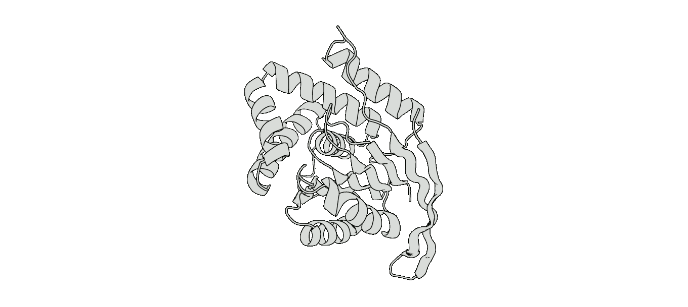

# 🚀 CLEO Workflow Tutorial

Welcome to this tutorial for **Combinatorial Libraries to Explore and Optimize (CLEO)**! This guide will walk you through the process of designing protein libraries and using experimental data to guide exploration and optimization. The framework focuses on enhancing an already functional protein construct using experimental feedback.

## 🌐 Overview

The two main themes of this workflow are:

1. [**Library Design**](#-library-design)
   - [Library constraints](#-library-constraints)
   - [Aligning proteinMPNN to rewards](#-aligning-proteinmpnn-to-rewards)
   - [Sampling and filtering sequence fragments](#-sampling-and-filtering-sequence-fragments)
   - [Reverse translating sequences to prepare for experimental assembly](#-reverse-translating-sequences-to-prepare-for-experimental-assembly)

2. [**Multi-Round Experimental Optimization**](#-multi-round-experimental-optimization)  
   - [Data collection philosophy and assay design](#-data-collection-philosophy-and-assay-design)  
   - [Strategies for early rounds of testing](#-strategies-for-early-rounds-of-testing)  
   - [Training sequence-to-function models](#-training-sequence-to-function-models)  
   - [Proposing batch of sequences to test next](#-proposing-batch-of-sequences-to-test-next)  
   - [Looping it all together](#-looping-it-all-together)

---

# ⚙️ Library Design



Changes in protein sequence space can lead to major jumps in function. To explore the surrounding sequence of a particular protein, this workflow will act as a guide to designing large scale libaries. To generate such libraries we will split a protein into fragments, propose many options for each fragment, and ordering the fragments independently will allow us to stitch the DNA together *in vitro* to create unique variants to test. This tutorial uses PETase (a plastic-degrading enzyme) as an example, however the workflow can apply widely to other proteins. The following steps will serve as a guide for first aligning proteinMPNN to custom reward functions and then sampling sequence fragments to create a library for experimental testing.

📌 **Note**: The libraries designed here focus on a single fold space, each variant will adopt a unique atomic constellation but retain a consistent topology. 

## 📐 Library constraints
One of the first steps to consider is how to split your protein into fragments. We recommend splitting the protein into equal length fragments of 20-50 amino acids for a total of 4-6 fragments. Splitting into equal size fragments helps ensure the *in vitro* assembly process is robust. Aiming for 4-6 fragments balances library size and experimental feasibility.

We have found that it does not matter too much where the splits occur, even splitting in the middle of secondary structure elements is fine. For designing an enzyme or binding protein it can be helpful to have multiple fragments in the active/binding site to allow for more combinatorial diversity in these key regions.

Assembling the fragments *in vitro* requires orhtogonal overhangs. [NEB Golden Gate Assembly](https://www.neb.com/en-us/nebinspired-blog/getting-started-with-golden-gate) requires designing 4 base pair overhangs that are unique to each junction. To facilitate this we recommend fixing 2 amino acids at the start and end of each fragment (which correspond to 12 base pair stretch to search for compatible overhangs within).

Fixing other residues which may be critical for function is easy to do in the config file. We provide an example [config](../library_design/config/denovo_petase.yaml) file for PETase here with more details on how to setup your own run.

## 🎯 Aligning proteinMPNN to rewards:


[Group relative policy optimization (GRPO)](https://arxiv.org/pdf/2402.03300) is the finetuning framework we use to align proteinMPNN to custom reward functions. Given a backbone, proteinMPNN will propose sequences, these sequences will then be evaluated by reward functions (including: structure prediction oracle, distance to reference, etc.), and finally the model is updated to increase the likelihood of sampling sequences with good rewards.

The [config](../library_design/config/denovo_petase.yaml) should serve as a template for how to setup your own run. Below we will break down some of the key components to consider, but please refer to the config file for more details.


### Defining the steps for reward function
To evaluate sequences we will need to define a series of steps to analyze the sequences proposed by proteinMPNN. These steps will be defined in the `reward.steps` section of the config. Each step is configured with the following fields:
- `name`: A unique name for the step.
- `target_fn`: The function to call to perform the analysis (should live in [library_design/utils](../library_design/utils/) folder).
- `cfg`: Parameters needed for the function.

Each step function will have the following structure:
```python
def step_fn(df_input: pd.DataFrame, cfg: Dict, step_name="step") -> pd.DataFrame:
    """
      Args:
         df_input (pd.DataFrame): Dataframe with sequences to analyze.
         cfg (Dict): Configuration parameters for the step.
         step_name (str, optional): Name of the step. Defaults to "step".
    """
   # perform analysis
   analysis_df = ...

   # merge results back into input dataframe
   df_output = pd.merge(df_input, analysis_df, on="name", how="inner")

   return df_output
```


For the work with PETase optimization we folded the sequences with a structure prediction oracle and measured a variety of distances between atoms involved with catalytic activity. In addition we also considered confidence metrics from the structure prediction oracles as well as hamming distance to the parent sequence. (ideally we want a range of mutations present for each fragment, in practice we can weight the reward for hamming distance to reference to control how many mutations away from the reference we converge to).

Once you are finished running through the steps in your analysis pipeline the reward can then be calculated. To compute the overall reward ( a scalar value for each sequence in the batch ) we will normalize the metrics to the range [0,1] and linearly combine all of the rewards using a weighted sum with weight W_i for each reward. These will need to be tailored for each run depending on your problem, as a basis it is most simple to start by setting all weights equal to 1.

Once all of the configs have been set, you can launch your run by running:


<<<placeholder for command to launch training run>>>

To track the training run you can plot the various metrics from a training run to see how the metrics are converging. You can take a look through the notebook (path to notebook) to see an example of how it might look to track the training)


## 🛠 Defining reward functions

First, define the **reward metrics** predictive of protein function. If no experimental data exists yet:
- Use structural prediction confidence, atomic distances, and hamming distances to the parent sequence.

If experimental data is already available (e.g., from a first round of testing):
- Train a custom predictor on the experimental results and incorporate its scores into the reward.


1. Fix **2 amino acids** at the start and end of each fragment (e.g., for Golden Gate Assembly compatibility 🧬).
2. Use a **structure prediction oracle** to assess sequences and calculate rewards.  
   - Example reward metrics: catalytic distances, confidence scores, mutational distances.

3. Normalize metrics to [0, 1] and compute the **overall scalar reward** as a weighted sum. Starting with equal weights is a good default.  

   Example code snippets for fine-tuning and reward functions are available in the <add link to config file>.  

### Launching Runs
Once your run setup is configured:
```bash
# Placeholder for training command
executetraining config.yaml
```

📝 **Tip**: Use the <path-to-notebook> to visualize metrics during training and track convergence.

## 🎲 Sampling and Filtering Sequence Fragments

After the model converges, you'll want to **sample sequences** for testing:
- Example: Sample 5,000 sequences if aiming to order 384 to allow for filtering.  
- The **goal** is to analyze fragment compatibility in silico and eliminate incompatible ones.

### Filtering and Constraints:
1. Rank fragments based on aggregated metrics.  
2. Apply constraints:
   - Diversity in mutation space (avoid over-optimization for a single point).  
   - Ensuring uniform distance from the parent sequence.  

A detailed example notebook demonstrating sequence filtering is available at <link-to-notebook>.

## 🧬 Reverse Translation and Order Preparation

Reverse translating protein sequences into DNA sequences is the final step before ordering. Key considerations:
- Use orthogonal codon pairs to ensure compatibility for assembly methods (e.g., ⛓️ NEB Golden Gate Assembly).  
- Validate assembly methods using tools like [Benchling](https://www.benchling.com/) or NEB's assembly wizard.

Positive controls: Split the original, active sequence into the same fragments to benchmark your experimental data.

---

# 🔬 Multi-Round Experimental Optimization

## 🧪 Data collection philosophy and assay design
Establish a robust assay that demonstrates clear, reproducible signal for your **positive control** over background noise. For PETase:
- Use Golden Gate Assembly to create DNA constructs.
- Express protein in a cell-free system and measure activity (e.g., using a fluorescent product signal).
- Normalize measurements (e.g., divide activity rates by protein concentration).

### Data filtering
- Use **thresholds**: e.g., protein expression ≥ 0.1 µM and CoV < 1 for replicates.  
- Provide metadata and plate maps in your dataset for improved reproducibility.  
📓 Refer to <link-to-data-processing-folder> for scripts and an example notebook.

---

## 🦠 Early Rounds of Testing

Decide how to screen your library. Two possible scenarios:
1. **Random Sampling**: Works best if ~10% of the variants show measurable activity.  
2. **Independent Fragment Testing**: Test fragments individually with parent fragments, analyze, and recombine the best-performing ones.  

Example figure from PETase **independent testing** (to be added).

---

## 🤖 Training Sequence-to-Function Models

Once experimental data is collected:
- Train a **predictive model** to map sequences to fitness.  
- Use a simple MLP (Multi-Layer Perceptron) with dropout layers and ensemble training.  

Normalization is key:
1. Scale the activity data (e.g., z-score).  
2. Split into training/validation sets (10%-20% validation).  

👨‍💻 Config and example notebook for training available: <link-to-notebook>.

---

## 🧠 Proposing Batch of Sequences to Test Next

With a trained model, propose new sequences for experimentation:
- Small libraries (<1 billion): Predict activity for all sequences.  
- Large libraries: Use a batched acquisition function that combines **mean activity prediction** and diversity optimization.  

💡 Additional Filtering Tips:
- Consider sequences with a **range of activities** to improve calibration.  
- Filter by predicted activity threshold for high-confidence candidates.

Notebook guide for batch optimization here: <link-to-batch-optimization-notebook>.

---

## 🔄 Looping it all together

Repeat the process (test → train → propose) until the activity metric plateaus. Satisfied with the results? 🎉 Congratulations, you’ve optimized your protein construct!

For advanced users:
- Use predictors trained on all collected data to generate a new library: <add link to config>.  

---

Thanks for following this tutorial! We hope this helps streamline your protein fitness optimization endeavors. Good luck! 💪🧬